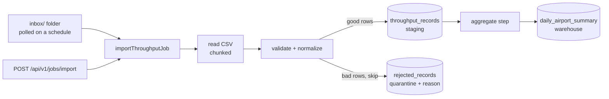

# conveyor


Batch ETL pipeline for airport checkpoint throughput data, built on Spring Batch. CSVs of hourly passenger counts come in (dropped in a folder or pushed over REST), get validated row by row, loaded into a staging table, and rolled up into a daily-summary warehouse table. Bad rows don't kill the job and don't vanish — they're skipped within a limit and quarantined with a reason.

Java 17 · Spring Boot 3 · Spring Batch 5 · PostgreSQL + Flyway · plain JDBC · Docker



## Run it

```bash
docker compose up --build       # app on :8091, postgres on :5434
cp data/sample_throughput.csv inbox/
```

Within ten seconds the poller picks the file up, runs the job, and moves it to `archive/`. Then:

```bash
curl localhost:8091/api/v1/summaries | python3 -m json.tool
```

Now feed it the poisoned file and watch it cope:

```bash
cp data/sample_throughput_dirty.csv inbox/
curl localhost:8091/api/v1/rejections | python3 -m json.tool
```

Six bad rows (negative counts, hour 30, a non-IATA airport name, an unparseable date, a truncated line, a non-numeric count) end up quarantined with reasons; the four good rows load anyway; the file still lands in `archive/` because the job completed with skips inside the limit.

## Or launch over REST

```bash
curl -X POST localhost:8091/api/v1/jobs/import \
  -H "Content-Type: application/json" -d '{"file":"data/sample_throughput.csv"}'
# → 202 Accepted {"executionId":1,"statusUrl":"/api/v1/jobs/1"}

curl localhost:8091/api/v1/jobs/1
# → status, exit code, per-step read/write/skip counts
```

The REST trigger launches asynchronously (202 + poll URL). The inbox poller launches synchronously on purpose — it needs the outcome to decide whether the file goes to `archive/` or `failed/`.

## The batch mechanics, honestly

- **Chunked processing** — rows stream through read→process→write in transactions of 100. A million-row file uses the same memory as a hundred-row file.
- **Skip policy with an audit trail** — `ValidationException` and unparseable lines are skippable up to 50 per job. Every skip writes the raw content + reason to `rejected_records`. Past the limit the job fails, because at that point the file itself is suspect, not the rows.
- **Restartability** — Spring Batch's metadata tables (`BATCH_*`) track every execution, so a job that dies mid-file restarts from where it stopped instead of double-loading. Job parameters (file + launch timestamp) identify each run.
- **Idempotent aggregation** — the summary step recomputes the warehouse table from staging on every run. At this scale a full recompute is simpler and safer than incremental merge logic; the trade-off is documented instead of pretended away.
- **Typed at the boundary** — the CSV row object is all strings on purpose; parsing happens in the processor so every bad value becomes a skippable rejection rather than a reader crash.

## API

| Method | Path | What |
|---|---|---|
| POST | `/api/v1/jobs/import` | Launch a load, `{"file": "path.csv"}` → 202 + execution id |
| GET | `/api/v1/jobs/{executionId}` | Status, exit code, per-step read/write/skip counts |
| GET | `/api/v1/summaries?airport=ATL` | Daily warehouse rows, optionally filtered |
| GET | `/api/v1/rejections` | Last 50 quarantined rows with reasons |

## Tests

```bash
mvn test
```

Unit tests pin every validation rule. The job-flow test runs the real pipeline against H2 (clean file → exact staging/summary numbers; dirty file → completes with exactly 6 quarantined rows). The API test launches through REST and polls to completion. No database install needed — H2 runs in PostgreSQL mode; Docker/CI use real Postgres.

## Layout

```
src/main/java/com/conveyor/
  batch/       csv row, record, processor (validation), skip listener, job listener
  config/      job + step definitions, async launcher
  scheduler/   inbox folder poller
  web/         job trigger/status API, summaries + rejections API
src/main/resources/db/migration/   Flyway schema (staging, warehouse, quarantine)
data/          sample CSVs — one clean, one deliberately poisoned
```
